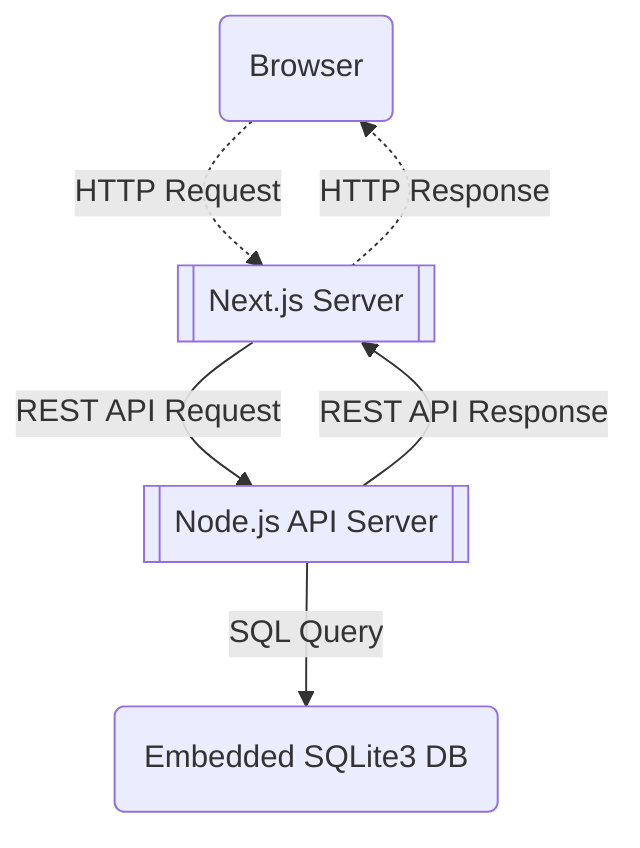

# retroview
Interview retrospective and study tracking app

## Architecture

```mermaid
graph TD;
  C("Browser") -.-> |"HTTP Request"| N[["Next.js Server"]];
  N --> |"REST API Request"| A[["Node.js API Server"]];
  A --> |"SQL Query"| D("Embedded SQLite3 DB");
  A --> |"REST API Response"| N;
  N -.-> |"HTTP Response"| C;
```

