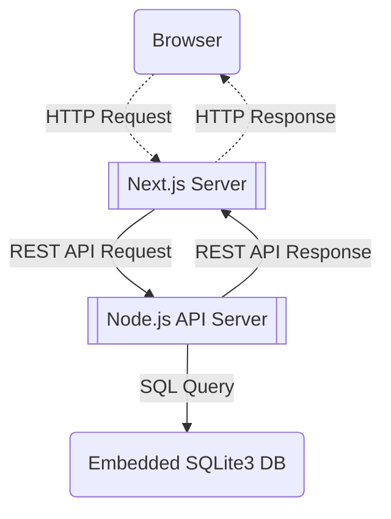
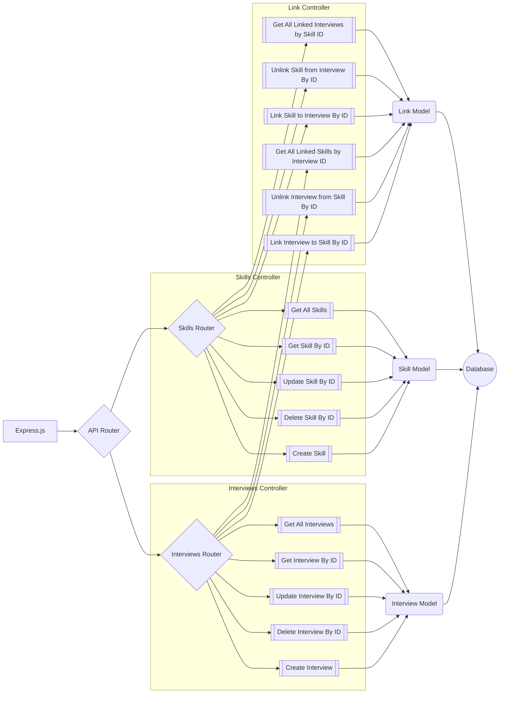
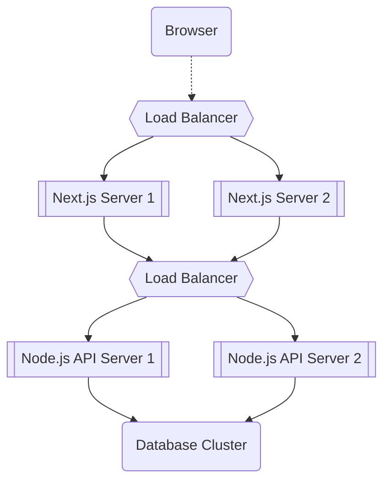

# retroview
Interview retrospective and study tracking app

## Architecture

```mermaid
graph TD;
  C("Browser") -.-> |"HTTP Request"| N[["Next.js Server"]];
  N --> |"REST API Request"| A[["Node.js API Server"]];
  A --> |"SQL Query"| D("Embedded SQLite3 DB");
  A --> |"REST API Response"| N;
  N -.-> |"HTTP Response"| C;
```

## Node.js Server

```mermaid
graph LR;
  E["Express.js"] --> RA{"API Router"};
  RA --> RI{"Interviews Router"};
  RA --> RS{"Skills Router"};
  subgraph "Skills Controller";
  RS --> SC[["Create Skill"]];
  RS --> SD[["Delete Skill By ID"]];
  RS --> SU[["Update Skill By ID"]];
  RS --> SG[["Get Skill By ID"]];
  RS --> SGA[["Get All Skills"]];
  end;
  subgraph "Interviews Controller";
  RI --> IC[["Create Interview"]];
  RI --> ID[["Delete Interview By ID"]];
  RI --> IU[["Update Interview By ID"]];
  RI --> IG[["Get Interview By ID"]];
  RI --> IGA[["Get All Interviews"]];
  end;
  subgraph "Link Controller";
  RI --> LC[["Link Interview to Skill By ID"]];
  RI --> LD[["Unlink Interview from Skill By ID"]];
  RI --> LGA[["Get All Linked Skills by Interview ID"]];
  RS --> LCS[["Link Skill to Interview By ID"]];
  RS --> LDS[["Unlink Skill from Interview By ID"]];
  RS --> LGAS[["Get All Linked Interviews by Skill ID"]];
  end;
  LC --> LM("Link Model");
  LD --> LM;
  LGA --> LM;
  LCS --> LM;
  LDS --> LM;
  LGAS --> LM;
  IC --> IM("Interview Model");
  ID --> IM("Interview Model");
  IU --> IM("Interview Model");
  IG --> IM("Interview Model");
  IGA --> IM("Interview Model");
  SC --> SM("Skill Model");
  SD --> SM
  SU --> SM
  SG --> SM
  SGA --> SM
  SM --> D(("Database"));
  IM --> D;
  LM -->D;
```

## Scale It!

```mermaid
graph TD;
  C("Browser") -.-> LB1{{"Load Balancer"}};
  LB1 --> N1[["Next.js Server 1"]];
  LB1 --> N2[["Next.js Server 2"]];
  N1 --> LB2{{"Load Balancer"}};
  N2 --> LB2;
  LB2 --> A1[["Node.js API Server 1"]];
  LB2 --> A2[["Node.js API Server 2"]];
  A1 --> D("Database Cluster");
  A2 --> D;
```
